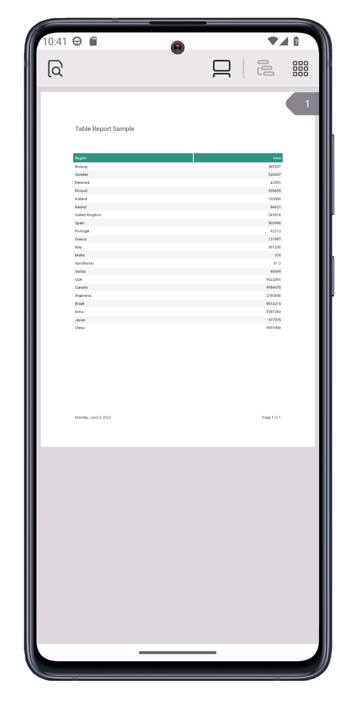

<!-- default badges list -->
[](https://docs.devexpress.com/GeneralInformation/403183)
<!-- default badges end -->

# DevExpress Reporting for .NET MAUI - Generate Bound-Data Report

This example implements a view that opens a PDF File, obtains form fields, and allows you to populate them. The sample application supports a limited set of PDF form fields. You can extend the capabilities of this sample (and support additional PDF form fields) as requirements dictate



## Included Controls and Their Properties

* [PdfViewer](https://docs.devexpress.com/MAUI/DevExpress.Maui.Pdf.PdfViewer): [ShowToolbar](https://docs.devexpress.com/MAUI/DevExpress.Maui.Pdf.PdfViewer.ShowToolbar), [DocumentSource](https://docs.devexpress.com/MAUI/DevExpress.Maui.Pdf.PdfViewer.DocumentSource)

## Implementation Details

1. Call the `CreateTableReportAsync()` function to generate a new report:

    ```csharp
    private async void ContentPage_Loaded(object sender, EventArgs e) {
        XtraReport report = await CreateTableReportAsync();
        string resultFile = Path.Combine(FileSystem.Current.AppDataDirectory, report.Name + ".pdf");
        // ...
    }
    ```

2. Call the `ExportToPdf(resultFile)` method to convert the report to PDF:

    ```csharp
    private async void ContentPage_Loaded(object sender, EventArgs e) {
        XtraReport report = await CreateTableReportAsync();
        string resultFile = Path.Combine(FileSystem.Current.AppDataDirectory, report.Name + ".pdf");
        report.ExportToPdf(resultFile);
        // ...    
    }
    ```

3. Use the `PdfViewer.DocumentSource` property to open the report  in the PDF Viewer:

    ```csharp
    private async void ContentPage_Loaded(object sender, EventArgs e) {
        XtraReport report = await CreateTableReportAsync();
        string resultFile = Path.Combine(FileSystem.Current.AppDataDirectory, report.Name + ".pdf");
        report.ExportToPdf(resultFile);
        pdfViewer.DocumentSource = PdfDocumentSource.FromFile(resultFile);
        // ...    
    }
    ```

## Files to Review

- [MainPage.xaml](./CS/MauiReportingApp/MainPage.xaml)
- [MainPage.xaml.cs](./CS/MauiReportingApp/MainPage.xaml.cs)
- [XtraReportInstance.Designer.cs](./CS/ReportLibrary/XtraReportInstance.Designer.cs)

## Documentation

* [PdfViewer](https://docs.devexpress.com/MAUI/DevExpress.Maui.Pdf.PdfViewer)
* [.NET Reporting Tools for Web, Mobile, and Desktop](https://docs.devexpress.com/XtraReports/2162/reporting)
* [.NET Reporting for .NET MAUI](https://www.devexpress.com/subscriptions/reporting/)
* [Configure a Report in the Visual Studio Designer](https://docs.devexpress.com/MAUI/404892/reporting/create-report-vs-designer)
* [Configure a Report in the Visual Studio Code Designer](https://docs.devexpress.com/MAUI/404930/reporting/create-report-in-vs-code-designer)
* [Create a Report in Code](https://docs.devexpress.com/MAUI/404891/reporting/create-report-in-code)

## More Examples

* [DevExpress .NET MAUI Demo Center](https://github.com/DevExpress-Examples/maui-demo-app)
* [Stocks App](https://github.com/DevExpress-Examples/maui-stocks-mini)
* [Data Grid](https://github.com/DevExpress-Examples/maui-data-grid-get-started)
* [Data Form](https://github.com/DevExpress-Examples/maui-data-form-get-started)
* [Data Editors](https://github.com/DevExpress-Examples/maui-editors-get-started)
* [Charts](https://github.com/DevExpress-Examples/maui-charts)
* [Scheduler](https://github.com/DevExpress-Examples/maui-scheduler-get-started)
* [Tab Page](https://github.com/DevExpress-Examples/maui-tab-page-get-started)
* [Tab View](https://github.com/DevExpress-Examples/maui-tab-view-get-started)
* [Drawer Page](https://github.com/DevExpress-Examples/maui-drawer-page-get-started)
* [Drawer View](https://github.com/DevExpress-Examples/maui-drawer-view-get-started)
* [Collection View](https://github.com/DevExpress-Examples/maui-collection-view-get-started)
* [Popup](https://github.com/DevExpress-Examples/maui-popup-get-started)
